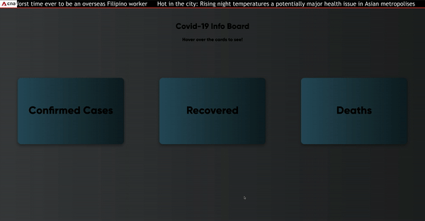

<h1 align="center">
  Fancy Covid Info Board
</h1>
<p align="center">
  A fancy covid info board made just for fun. Displays covid data from Singapore, USA and Thailand
</p>
<p align="center">
  View it live <a href="http://fancy-covid-data.s3-website-ap-southeast-1.amazonaws.com" target="_blank">here!</a>
</p>



## 👍 How to Use This Repository
The source code is free for you to use as reference or to build upon. Have fun! Flip card animation adapted from W3schools

## 🛠 Installation & Set Up

1. Install dependencies

   ```sh
   npm install
   ```

2. Start the development server

   ```sh
   npm start
   ```

## ❓ Additional Notes

This is used as a demonstration to how data can be passed from a parent component to a child component as props
